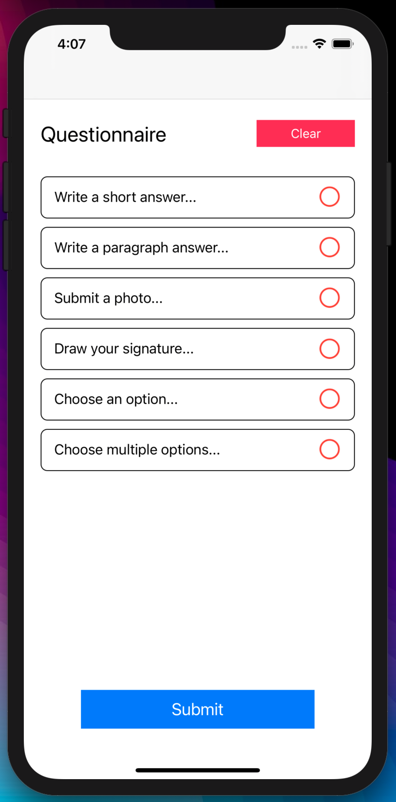
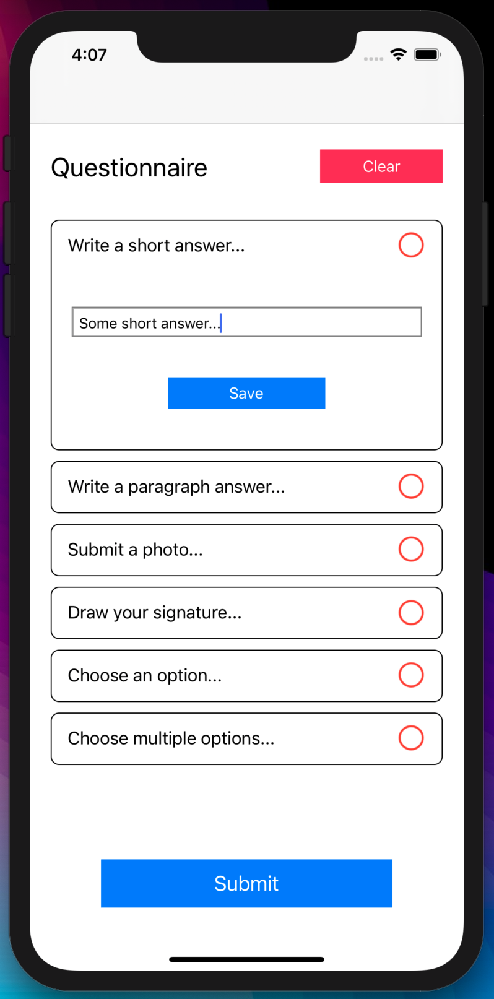
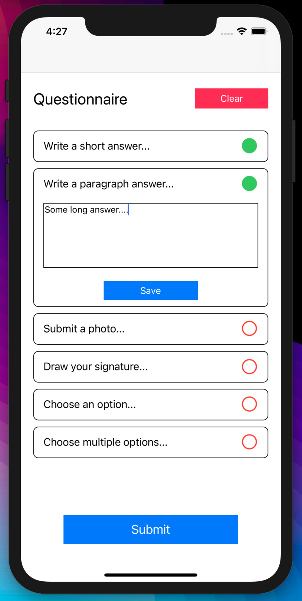
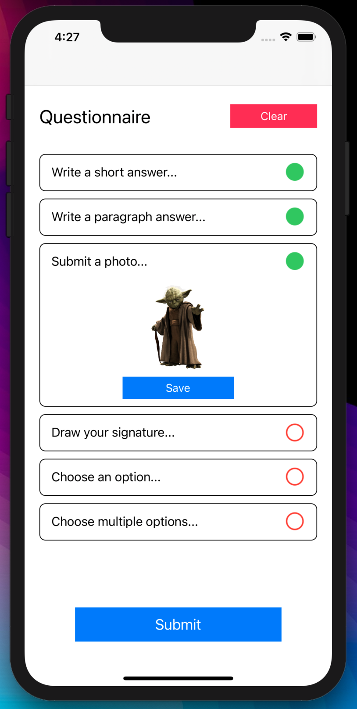
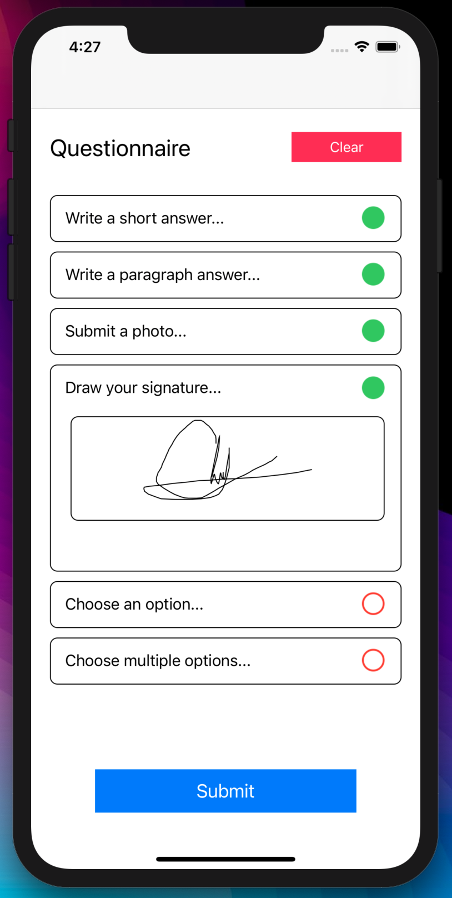
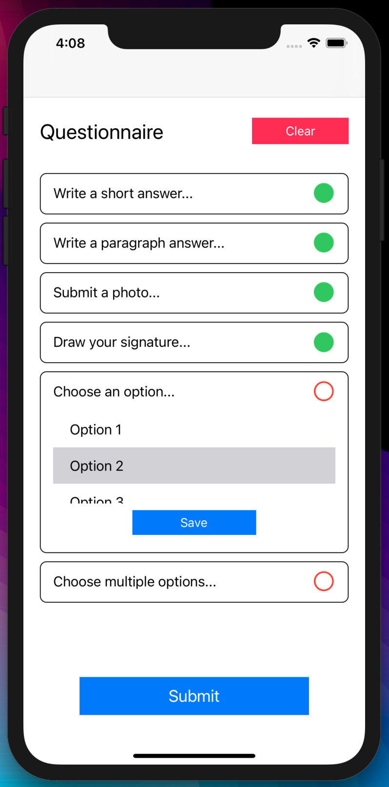
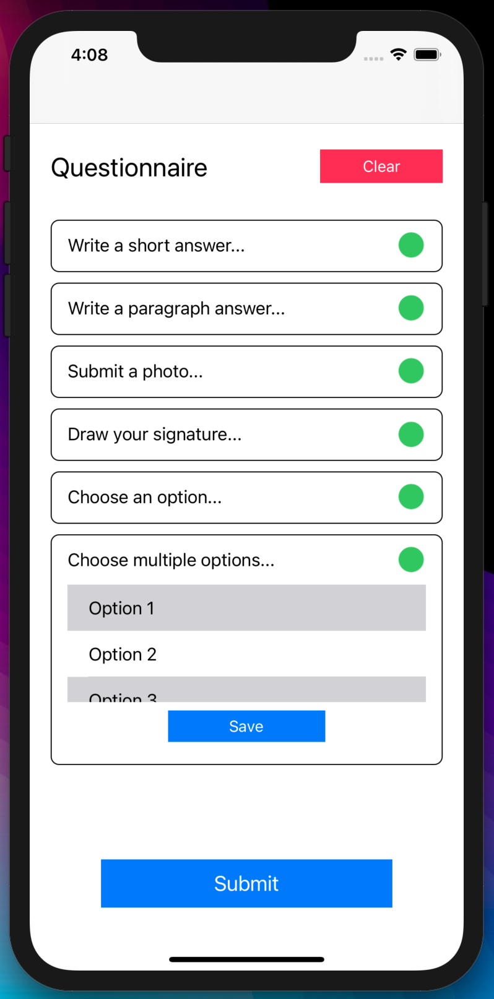
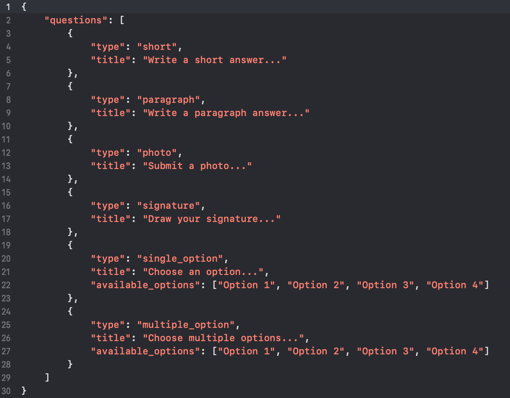
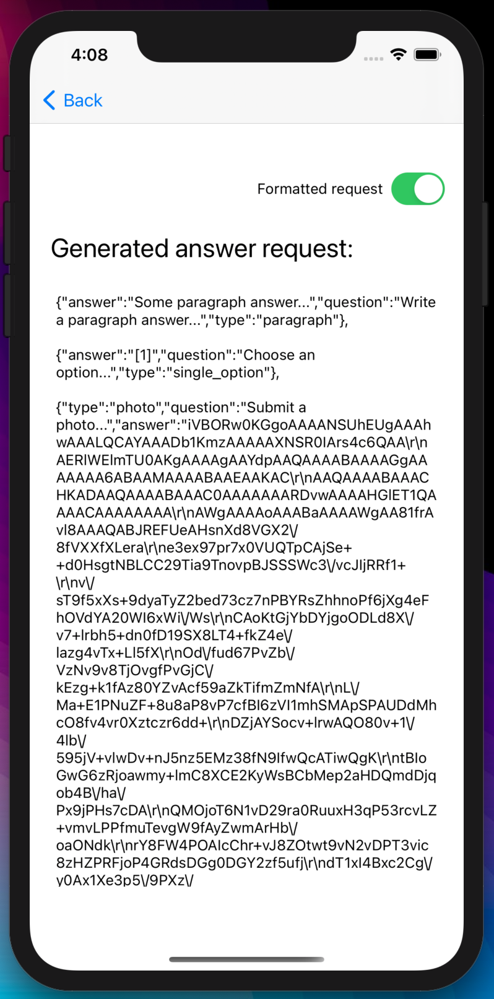
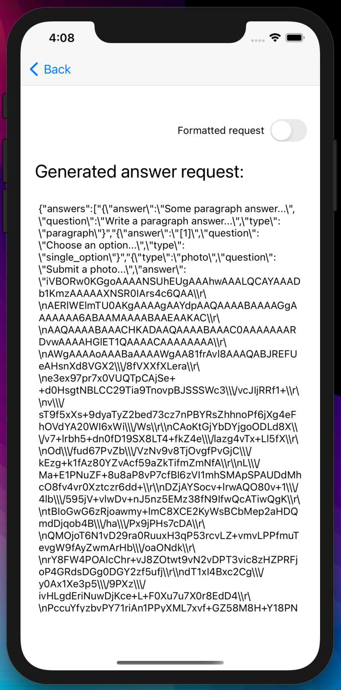

[![Contributors][contributors-shield]][contributors-url]
[![Forks][forks-shield]][forks-url]
[![Stargazers][stars-shield]][stars-url]
[![Issues][issues-shield]][issues-url]
[![MIT License][license-shield]][license-url]
[![LinkedIn][linkedin-shield]][linkedin-url]

<!-- PROJECT LOGO -->
 

  

  <h3 align="center"></h3>

  

    Drop-down questionnaire.
     
    Drop-down questionnaire made in Swift. It implements a UITableView with expandable cells on selection.
     
    <a href="https://github.com/IvanPedrero/Drop-Down-Questionnaire">View Demo</a>
  

<!-- TABLE OF CONTENTS -->

  
Table of Contents

  <ol>
    <li>
      <a href="#about-the-project">About The Project</a>
      <ul>
        <li><a href="#built-with">Built With</a></li>
      </ul>
    </li>
    <li>
      <a href="#getting-started">Getting Started</a>
      <ul>
        <li><a href="#prerequisites">Prerequisites</a></li>
        <li><a href="#installation">Installation</a></li>
      </ul>
    </li>
    <li><a href="#license">License</a></li>
    <li><a href="#contact">Contact</a></li>
  </ol>

<!-- ABOUT THE PROJECT -->
## About The Project

 

  

 

Drop-down questionnaire made in Swift. It implements a UITableView with expandable UITableViewCells on selection.

The question types implemented are:

* Short: For questions that need short answers.

  

* Paragraph: For questions that need long answers.

  

* Photo: For questions that need an image from the gallery or camera.

  

* Signature: For questions that need a signature.

  

* Single or multiple option: For questions that need a selection of provided answers (can be single or multiple).

  
  

The information is read from a dummy JSON file that contains the question information, simulating an API request that provides said questionnaire.

  

When submitting the questionnaire, the algorithm will create a JSON object with the saved information gathered from the 
saved answers. The app will open a new view with the formatted JSON object and will display its information in the screen.

  

 

You will be able to see the unformatted JSON string for the request if the switch in this view is off.

  

 

### Built With

* [Xcode](https://developer.apple.com/xcode/)

<!-- GETTING STARTED -->
## Getting Started

What you'll need to run the app:

### Prerequisites

* MacOS (Catalina or higher)
* Xcode (11.0 or higher)
* iPhone or iPod (if you want to run the app in a physical device)

### Installation

1. Open the project .xcodeproj file.
2. Run the app in the simulator or device.

 

  

 

<!-- LICENSE -->
## License

Distributed under the MIT License. See `LICENSE` for more information.

<!-- CONTACT -->
## Contact

Ivan Pedrero - [LinkedIn](https://www.linkedin.com/in/ivan-pedrero/) - pedrero.ivan@hotmail.com

Project Link: [https://github.com/IvanPedrero/Drop-Down-Questionnaire](https://github.com/IvanPedrero/Drop-Down-Questionnaire)

<!-- MARKDOWN LINKS & IMAGES -->
<!-- https://www.markdownguide.org/basic-syntax/#reference-style-links -->
[contributors-shield]: https://img.shields.io/github/contributors/othneildrew/Best-README-Template.svg?style=for-the-badge
[contributors-url]: https://github.com/IvanPedrero/Drop-Down-Questionnaire/graphs/contributors
[forks-shield]: https://img.shields.io/github/forks/othneildrew/Best-README-Template.svg?style=for-the-badge
[forks-url]: https://github.com/IvanPedrero/Drop-Down-Questionnaire/network/members
[stars-shield]: https://img.shields.io/github/stars/othneildrew/Best-README-Template.svg?style=for-the-badge
[stars-url]: https://github.com/IvanPedrero/Drop-Down-Questionnaire/stargazers
[issues-shield]: https://img.shields.io/github/issues/othneildrew/Best-README-Template.svg?style=for-the-badge
[issues-url]: https://github.com/IvanPedrero/Drop-Down-Questionnaire/issues
[license-shield]: https://img.shields.io/github/license/othneildrew/Best-README-Template.svg?style=for-the-badge
[license-url]: https://github.com/IvanPedrero/Covid-19_Intelligent-Assistantblob/master/LICENSE.txt
[linkedin-shield]: https://img.shields.io/badge/-LinkedIn-black.svg?style=for-the-badge&logo=linkedin&colorB=555
[linkedin-url]: https://www.linkedin.com/in/ivan-pedrero/
[product-screenshot-1]: images/ss1.png 
[product-screenshot-2]: images/ss2.png
[product-screenshot-3]: images/ss3.png
[product-screenshot-4]: images/ss4.png
[product-screenshot-5]: images/ss5.png
[product-screenshot-6]: images/ss6.png
[product-screenshot-7]: images/ss7.png
[product-screenshot-8]: images/ss8.png
[product-screenshot-9]: images/ss9.png
[product-screenshot-10]: images/ss10.png
